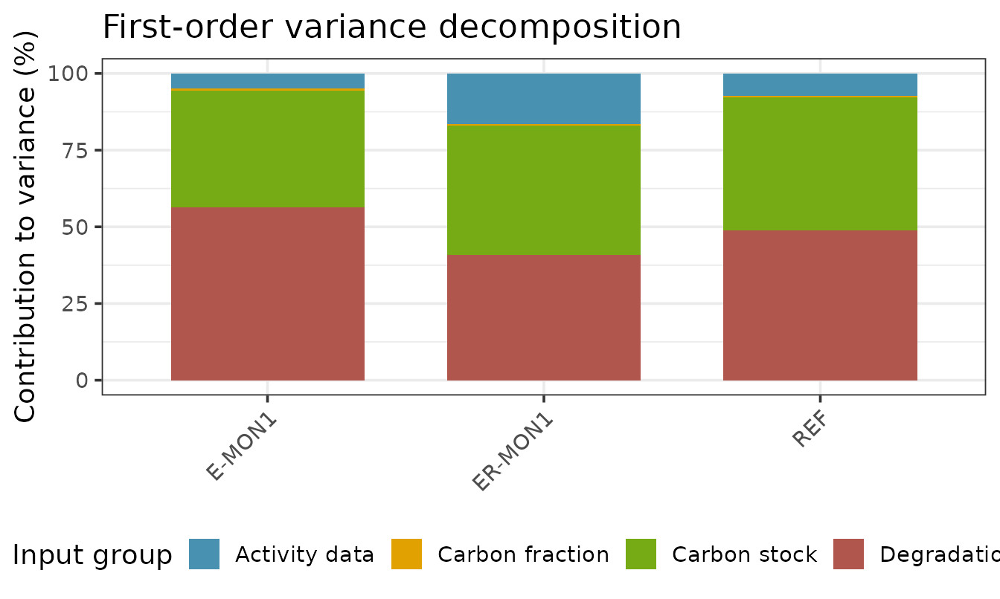
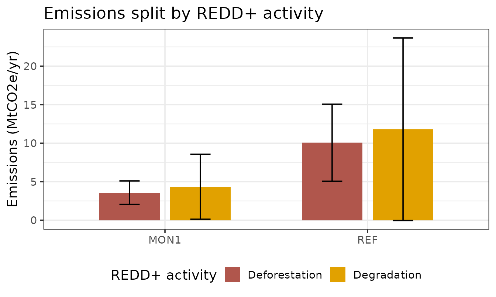

# Sensitivity analysis for REDD+ carbon accounting

``` r

library(mocaredd.dev2)
```

## Why sensitivity analysis?

A REDD+ emission reduction estimate combines many uncertain inputs:
areas of land use change (**activity data**, AD), carbon stocks of each
land use, a carbon fraction, and degradation ratios (together the
**emission factors**, EF). Uncertainty analysis (see
[`fct_arithmetic_mean2()`](https://gaelso.github.io/mocaredd.dev2/reference/fct_arithmetic_mean2.md))
tells you *how uncertain* the result is. **Sensitivity analysis**
answers the complementary question: *which inputs are responsible for
that uncertainty?* This is what tells a country where to invest the next
measurement campaign — improving the input that drives the variance is
the cheapest way to shrink the confidence interval of the reported
emission reduction.

## The emission model

For each land use transition, emissions are activity data times an
emission factor:

``` math
E \;=\; AD \times EF \times \tfrac{44}{12}, \qquad EF = C_\text{initial} - C_\text{final}
```

where each carbon stock $`C`$ is built from carbon pools (optionally
through a carbon fraction and, for degraded land, a degradation ratio
applied to the intact stock). Reference and monitoring emission *levels*
are period aggregates of these transitions, and the **emission
reduction** is their difference:

``` math
ER = E_\text{REF} - E_\text{MON}.
```

Because a degraded land use reuses the intact carbon stock, and a global
carbon fraction is shared across land uses, some inputs feed several
parts of the model at once. A correct sensitivity analysis must respect
those shared inputs.

## Variance-based sensitivity analysis

The reference framework for global sensitivity analysis is the
**variance-based (Sobol) decomposition** (Saltelli et al. 2008). If the
output $`Y`$ is a function of independent inputs $`X_1,\dots,X_k`$, its
variance decomposes into contributions of each input and of their
interactions:

``` math
\operatorname{Var}(Y) = \sum_i V_i + \sum_{i<j} V_{ij} + \dots
```

Two indices summarise this:

- the **first-order index** $`S_i = V_i / \operatorname{Var}(Y)`$, the
  share of variance explained by $`X_i`$*alone*;
- the **total index** $`S_{T_i}`$, which also includes every interaction
  involving $`X_i`$.

Sobol indices are usually estimated by Monte Carlo with Saltelli
sampling, at a cost of $`N\,(k+2)`$ model runs. That is the most general
approach and it captures interactions, but it is stochastic and
comparatively expensive.

### The approach used in `mocaredd`

The REDD+ emission model is a sum of products (`AD × EF`), which is
close to linear in each input over its uncertainty range. For such a
model the first-order Sobol indices can be obtained **analytically**
from a first-order (delta-method) expansion. For independent inputs,

``` math
\operatorname{Var}(Y) \;\approx\; \sum_i \Big(\tfrac{\partial Y}{\partial X_i}\Big)^2 \sigma_i^2,
\qquad
S_i \;\approx\; \frac{\big(\partial Y/\partial X_i\big)^2 \sigma_i^2}{\operatorname{Var}(Y)} .
```

[`fct_sensitivity2()`](https://gaelso.github.io/mocaredd.dev2/reference/fct_sensitivity2.md)
computes the partial derivatives numerically over the same independent
inputs used by the Monte Carlo simulation (carbon pools namespaced by
land use, the carbon fraction, degradation ratios and per-transition
activity data), so shared inputs propagate consistently — perturbing a
forest’s biomass changes both its intact stock and any degraded stock
derived from it. The per-input contributions are then summed into
REDD+-meaningful **input groups**:

- **Activity data** — transition areas,
- **Carbon stock** — the carbon pools of each land use,
- **Carbon fraction** — the biomass-to-carbon conversion,
- **Degradation ratio** — the ratios defining degraded stocks.

This is deterministic, essentially free to compute, and consistent with
the IPCC Tier 1 uncertainty already reported by the package. Its
limitation is that, being first-order, it does not resolve interaction
terms; when interactions are expected to be large, a full Sobol analysis
is the appropriate alternative (sketched at the end of this article).

## Worked example

``` r

path    <- system.file("extdata/mocaredd-templatev2-simple.xlsx", package = "mocaredd.dev2")
checked <- fct_checkinput(.path = path)
#> Loading data... - progress: 0%.
#> ✓ Tables loaded successfully from template v2
#> Checking column names... - progress: 14%.
#> ✓ Column names: all required columns present
#> Checking table dimensions... - progress: 29%.
#> ✓ Table sizes: all tables have sufficient rows
#> Checking column data types... - progress: 43%.
#> ✓ Data types: all columns have correct data types
#> Checking category values... - progress: 57%.
#> ✓ Category values: all categories are valid
#> Checking unique IDs... - progress: 71%.
#> ✓ Unique IDs: no duplicates or missing IDs found
#> Checking cross-table and intra_table consistency... - progress: 86%.
#> ✓ Cross-table consistency: all references match
#> -- All checks passed.

sa <- fct_sensitivity2(.checked_data = checked)
```

### Which inputs drive the uncertainty?

The variance of each reference / monitoring level (`REF`, `E-MONx`) and
of each emission reduction (`ER-MONx`) is decomposed into the four input
groups. The contributions sum to 100% for each output.

``` r

sa$variance
#> # A tibble: 12 × 3
#>    output  group             contribution_pct
#>    <chr>   <chr>                        <dbl>
#>  1 REF     Carbon stock                  43.3
#>  2 REF     Degradation ratio             48.9
#>  3 REF     Activity data                  7.2
#>  4 REF     Carbon fraction                0.6
#>  5 E-MON1  Carbon stock                  38.2
#>  6 E-MON1  Degradation ratio             56.3
#>  7 E-MON1  Activity data                  4.8
#>  8 E-MON1  Carbon fraction                0.7
#>  9 ER-MON1 Carbon stock                  42.3
#> 10 ER-MON1 Degradation ratio             40.8
#> 11 ER-MON1 Activity data                 16.4
#> 12 ER-MON1 Carbon fraction                0.5
```

``` r

sa$gg_variance
```



Reading the chart: a bar dominated by *Carbon stock* or *Degradation
ratio* means the emission factors drive the uncertainty and better field
measurements would help most; a bar dominated by *Activity data* points
instead to the land-use change mapping.

### Splitting emissions by REDD+ activity

When both deforestation (DF) and degradation (DG) are reported,
emissions are split by activity, each with its own uncertainty
($`U\% = z \cdot se / |mean| \cdot 100`$):

``` r

sa$split
#> # A tibble: 4 × 7
#>   period_type activity         E     E_se   E_U  E_lower   E_upper
#>   <chr>       <chr>        <dbl>    <dbl> <dbl>    <dbl>     <dbl>
#> 1 REF         DF       10063039. 3040319.  49.7 5062159. 15063919.
#> 2 REF         DG       11811117. 7204693. 100.   -39549. 23661783.
#> 3 MON1        DF        3577161.  926229.  42.6 2053649.  5100673.
#> 4 MON1        DG        4347903. 2564672.  97.0  129394.  8566413.
```

``` r

sa$gg_split
```



This shows not only how much each activity contributes to the total
emissions but also how well each is constrained — degradation is often
the more uncertain term.

## The Sobol alternative

When interactions between inputs matter, estimate variance-based indices
by Monte Carlo. The model here is already available as a function of its
inputs, so the inputs can be resampled from their distributions and
passed through the same calculation chain. Conceptually (not run):

``` r

# install.packages("sensitivity")
library(sensitivity)

# model(X): a matrix of input draws -> vector of ER estimates
# built from the same primitives fct_sensitivity2() perturbs
X1 <- sample_inputs(n = 10000)   # matrix, one column per input
X2 <- sample_inputs(n = 10000)

si <- sobolSalt(model = redd_model, X1, X2, scheme = "A", nboot = 100)
plot(si)                          # first-order and total-order indices
```

`sobolSalt()` returns both first-order and total indices; comparing them
reveals how much variance lives in interactions. For the mostly
multiplicative REDD+ model the analytical first-order decomposition
above is usually within a few percent of the Monte Carlo first-order
indices, which is why it is the default here.

## References

- IPCC (2006, 2019 refinement) *Guidelines for National Greenhouse Gas
  Inventories*, Volume 1, Chapter 3 — Uncertainties.
- Saltelli, A. et al. (2008) *Global Sensitivity Analysis: The Primer*.
  Wiley.
